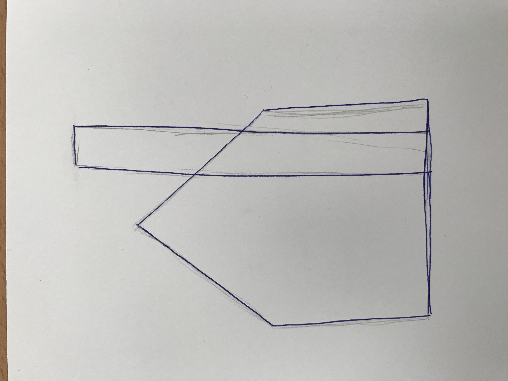
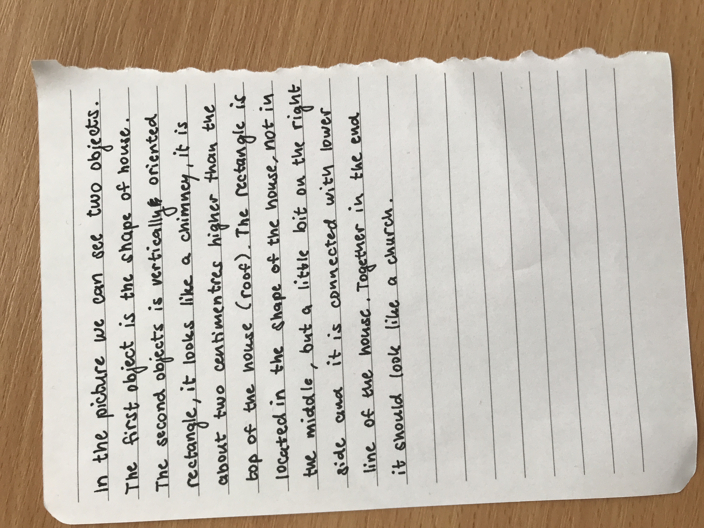

# Two objects
## _"Easy peasy" construction_

---
In the picture we can see two objects... 
- ROOF
- CHIMNEY/TOWER
- = CHURCH
---

## Description
1. The first object is the shape of house. 
2. The second object is vertically oriented rectangle, it looks like a chimney.
3. It is about two centimetres higher than the top of the house. 
4. The rectangle is located in the shape of the house, not in the middle, but a little bit on the right side and it is connected with lower line of the house. 
5. Together in the end it should look like church.

---

