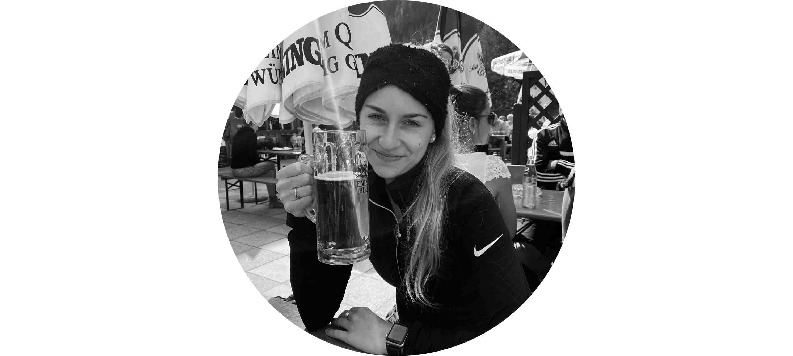

# Tereza Budská

## About Me

I am a graphic designer, dancer and lover of music.

- [Project](case-study.md) 🌸

## My Story

When I was a child I went to an art school in Prague named DRAW PLANET. I went to this art course for about 2 years. 

After primary school, I went to secondary school DUKE - of Design and Art, Book Culture, and Economics Náhorní. 

For about 10 days I was in practice in a small IT company named Abuco ICT and they gave me a job as a graphic designer. I create web design, online banners, posts, visual identity, icons, illustrations, etc.

However now I am a student in VŠKK, I am working externally for a few companies. My hobbies are dancing, sketching, painting, listening to music, and playing games. 
