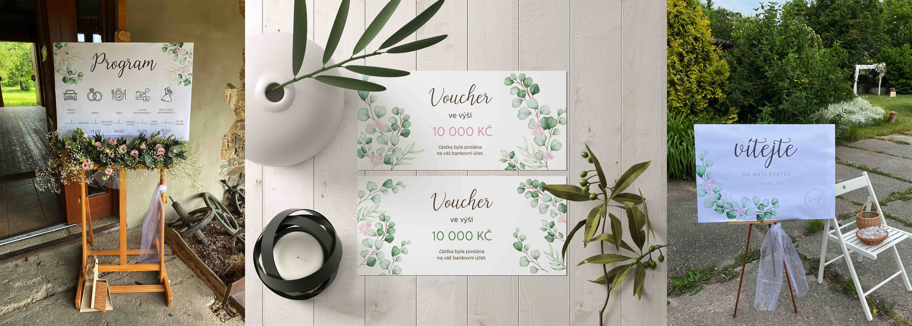
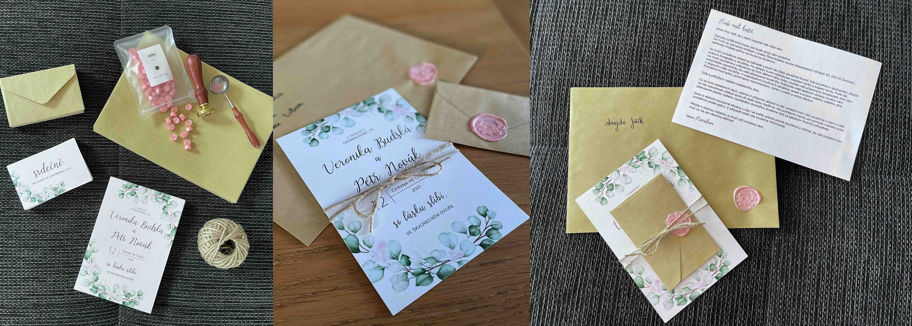

# 🌸🌿 Wedding design

## Brief
I would like to introduce visual identity, which describes the wedding day of my sister and her husband.

- 12th June, 2021
- V + P

## Description
I created a schedule of a wedding day, a voucher for newlyweds like a gift, welcome poster (without welcome drink:)), wedding invitation, and invitation to the wedding table.

---

- schedule of a wedding day (A1)
- voucher for newlyweds
- welcome poster (A1)

- wedding announcement / invitation
- invitation to the wedding table

## What did the design look like?
1. I used thin font, cold colors with light pink. 
2. All sheets of paper were created on thick silver paper.
3. My sister’s favorite plant is eucalyptus - pure, cold, decent, minimalist… So I used this green plant with small, pink flowers.
4. Each invitation contains a naturally small and large envelope in brown color.

## And result?
My sister was excited and I would like to try to create another wedding invitation for people.
