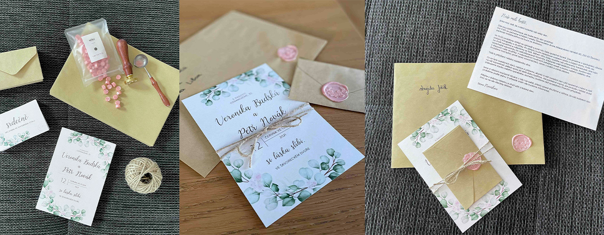

# 🌸🌿 Wedding design

12th June, 2021 was the wedding day of my sister.

- V + P

- program of wedding day (A1)
- voucher for newlyweds
- welcome poster (A1)

- wedding announcement / invitation
- invitation to the wedding table

---

The whole visual identity describes the wedding day of my sister and her husband.
I created a program for the wedding day, a voucher for newlyweds like a gift, welcome poster (without welcome drink:)), wedding invitation, and invitation to the wedding table.

1. I used thin font, cold colors with light pink. 
2. All sheets of paper were created with strong, silver paper.
3. My sister’s favorite plant is eucalypt - pure, cold, decent, minimalist… So I used this green plant with small, pink flowers.
4. Each invitation includes a natural, brown small, and big envelope.
