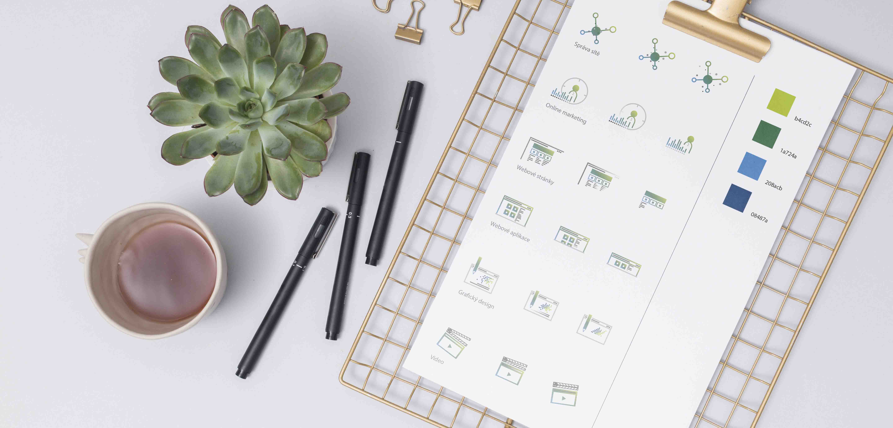
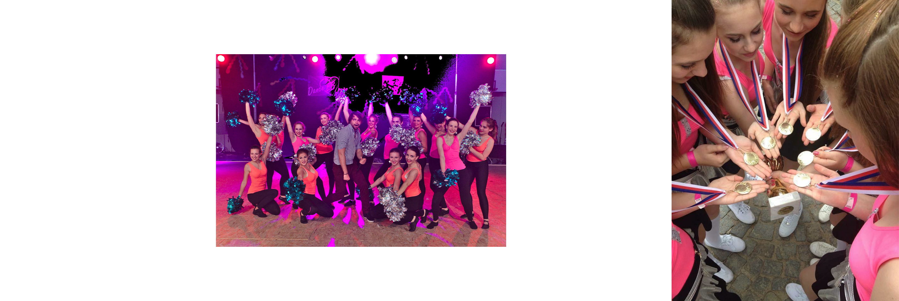

#  My design story 👩🏼‍🎨 

Hi! I am a graphic designer and I am specializing in creativity and visual identity.

The first question is why did I decide to be an artist?

- My journey started at about 11 years old... At this age, I fell in love with art. I started drawing on notebooks, sometimes on the walls. I learned what magic you can do with two ordinary neutral colors - black and white. That was the point why I decided to absolve an art course called Draw Planet in Prague. 
So that was the reason why I decided to continue my studies at art school. At the same time, this course prepared me for the exams in high school.

In my free time, I sketched and started a painting on the wall like a professional painter. And there is my first picture from Draw Planet and painting on the wall!

- My journey continued at the DUKE high school - design and art, book culture, and economics in Náhorní. Over the course of 4 years, I learned to work with watercolors, inks, or pastels.
It was a very creative school.

- During our studies, we had to complete the required 10-day internship. I wrote an email to the IT company Abuco ICT, which I found on the Internet, and finally, they offered me a job. Now I am working for this company as a creative graphic designer. I often work with online advertising, I am creating banners, posts, gifs, icons, and sometimes I work with offline advertising such as flyers, business cards, flags, posters. 

There are some icons for the company, which I created.

- However, we will deviate a bit from the artistic side … My great inspiration was dancing. From the age of 5, I danced various types of dance such as aerobics, street dance, or cheerleaders. Thanks to this sport, I came up with many ideas. In this sport, I was relaxed from all worries and responsibilities. I felt like I was a completely different person. However, the team fell apart, but I still like to run and dance for myself…

- Now. I'm here. I study at university and work with 3 companies. I'm a girl, a cat lover. I like to go out where I collect inspiration and look for power.
And my future? The future is a matter of time ... However, I want to continue what I am doing.

Thank you for your attention!

