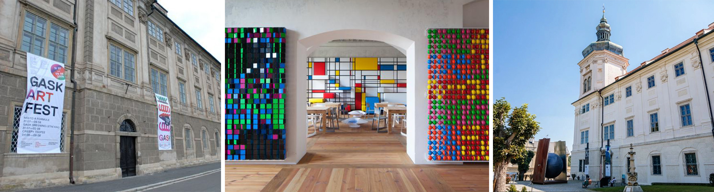
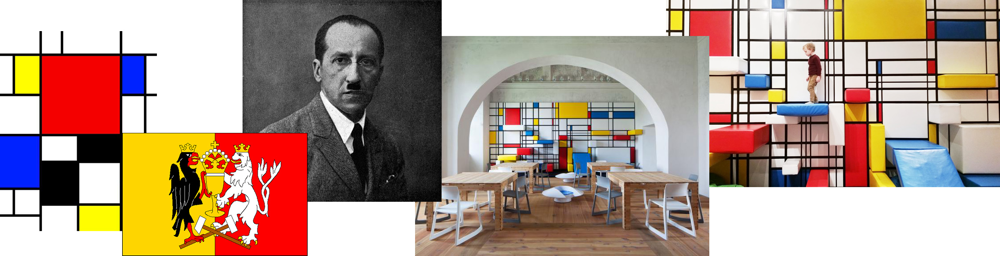
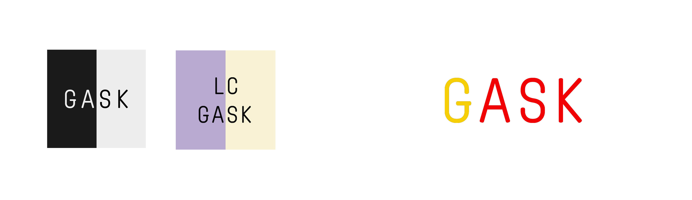

## 🟥 My thesis project 💁🏼‍♀️ Education center GASK 🟨

- [Summary](#summary)
- [Inspiration](#inspiration)
- [Keywords](#keywords)
- [Key Points](#key-points)
- [Warm-Up](#warm-up)

---

## Summary ⚡️
- GA - Gallery, S - Central Bohemian (Středočeský), K - Region (Kraj)
- During my studies at the school in the field of graphic design and media communication, I gained a lot of experience. For this reason, I decided to accept the challenge in the field of visual and marketing communication and create a new working concept of visual communication for the education center. 

- The center is operated by the organization Gallery of the Central Bohemian Region in Kutná Hora. The center was established to understand and bring contemporary art to the public as a natural way of life. 

---

### What problems did the project solve?
- My goal is to create visual communication and strategic solution for the education center GASK in Kutná Hora and at the same time to raise attendance of the gallery. At the same time, I want to raise awareness of the education center, to build a positive public attitude towards this place so that the GASK organization becomes a new refuge and visiting the place.
- This gallery offers the most programs, workshops, and events for children and families. So I decided to focus on the lower age category, thanks to their offer for children and youth.
- The project is still in process. I want to run higher activity on social networks, especially Instagram which has the highest expansion today.

### What actions did you take to this project?
- I was at the GASK center a few years ago, thanks to which I know the center better. So I know this center is a great place for kids.
- For a few months, I conducted a thorough competition analysis and surveys - what are the advantages and disadvantages. I found a lot of interesting places and centers - both foreign and in the Czech Republic. 

### How successful where you in solving the problem?
- I think that thanks to this project, I will help the center get into the subconscious of customers. I will show what makes the center special.

---

## Inspiration 💫 
- 🔴 🟡 + 🔵
- In terms of colors. Kutná Hora has a flag, which consists of red and yellow. These two colors are primary and I chose blue as the secondary color. And why? My great inspiration was a climbing wall for children. The climbing wall was created based on a work of art by artist Piet Mondrian. 
- However, my main and great inspiration is children. I want the overall visualization to be playful, funny, and engaging.

---

- I created a new logotype GASK that will characterize the educational center. My primary goal was to create a logotype that will create simple communication. The word ASK will therefore accompany us throughout the communication and thanks to that I will create headlines with questions.
- Next, I will create a new communication concept using offline and online advertising.
- As an example of my project, I will show you the existing logo of the education center and my new design. But everything is in the process, maybe I'll change something and I'll show you what I created later.

---
## Keywords 💥
- analysis, colors, communication, customers, education center, gallery, GASK Kutná Hora, graphic design, identity, kids, logotype, marketing, strategy, social media, typography, visualization

---

## Key points 💥
1. Background/importance of topic: The organization's education center does not currently have a visual and communication style, so I will create a new communication strategy.
2. Purpose/hypothesis (thesis or statement of problem): I want to raise the profile of the education center in Kutná Hora, lure more children, activity, and traffic on social networks.
3. Research — design/methodology/approach including procedures/data/observations: Thanks to the cooperation, the center provided me with some materials, which I will make full use of. I also focused on the competition, their social networks, websites, visual identity, and marketing communication. I'm working on visualization now.
4. Findings (highlight outcome of research): I will help the center increase attendance and subconscious. I will create a new and original visual and marketing communication.
5. Conclusions (significance/success of study to theory/practical/society): The project is still in progress. However, it would be a success to establish cooperation in the future.

---

## Warm-up 💥
1. Problem
- No communication strategy of the education center.
- According to my analysis, 80% of 150 people do not know the educational center in Kutná Hora.

2. Action
- Search for foreign and Czech centers.
- Creating my own graphs, thanks to which I got the answers to my own questions.
- Communication with education center.
- Creating a new visual and communication identity.

3. Result
- Long-term cooperation with the organization in the future.
- Quality and original project.
- Gaining new customers who will recommend the center to their friends.

