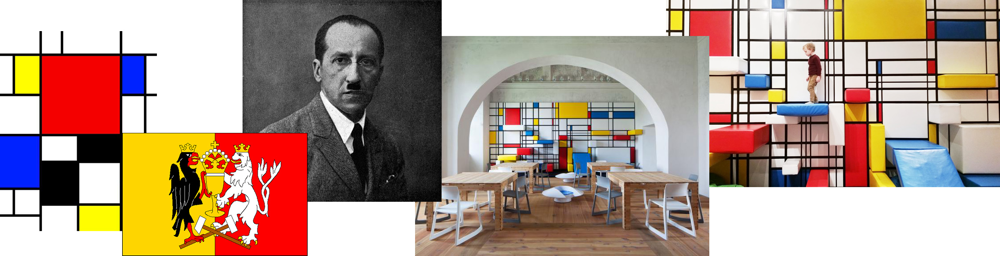
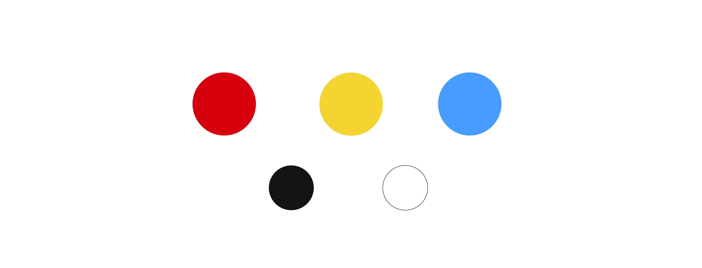
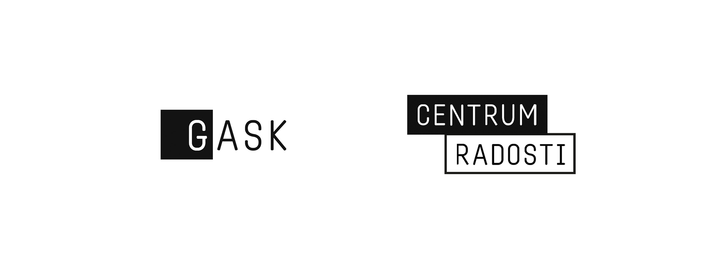
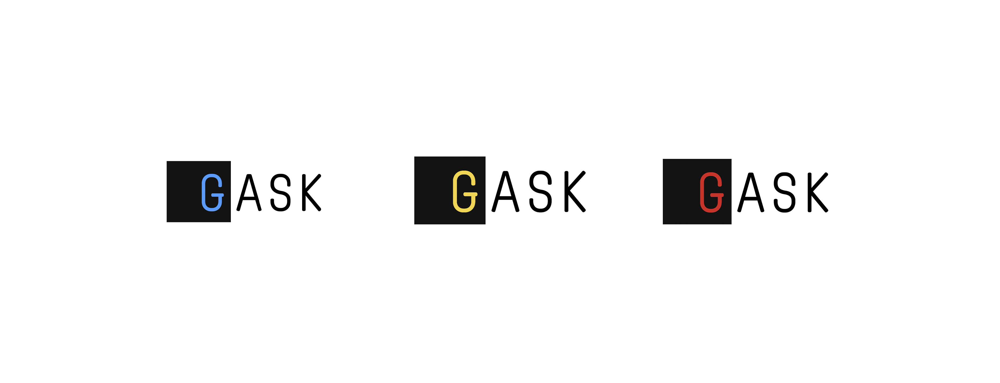
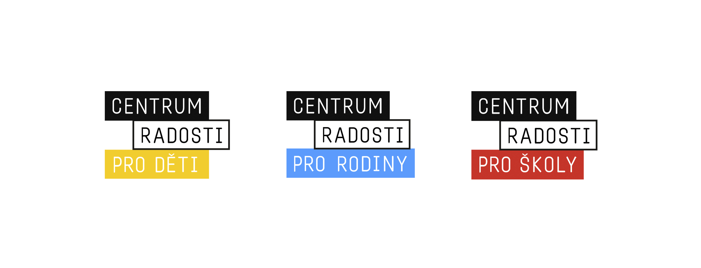
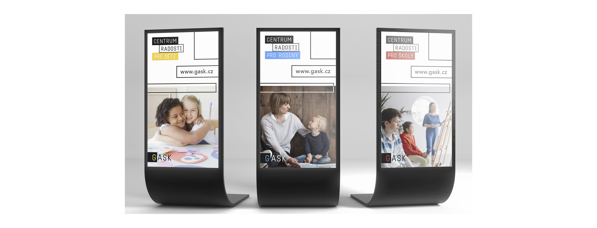
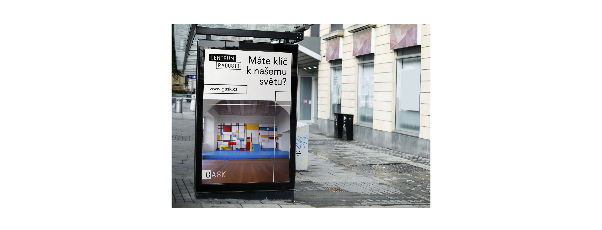

## 🟥 Visual identity and marketing communication of an education center GASK 🟨

### Abstract
- The project is still in process. My goal is to create new, original, visual communication and strategic solution for the education center and at the same time to raise the attendance of the gallery. Now I have analysis and research and I am working on a visual style. My important element is a strategic solution.

---

### Keywords
- colors, education center, GASK Kutná Hora, graphic design, logotype, marketing communication, new communication, presentation, typography, visual identity

---

### Presentation
- I present to you my newly created communication of the center.

#### Inspiration
- My main and great inspiration is children. I want the overall visualization to be playful, funny, and engaging.
- My great inspiration was a climbing wall for children. The climbing wall was created based on a work of art by artist Piet Mondrian. 

#### Logotype
-

#### Posters

#### Billboards
-

#### Social media
-
