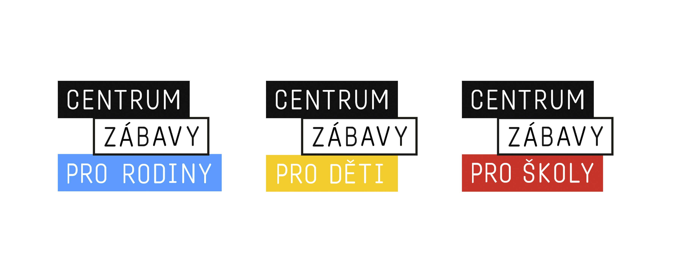
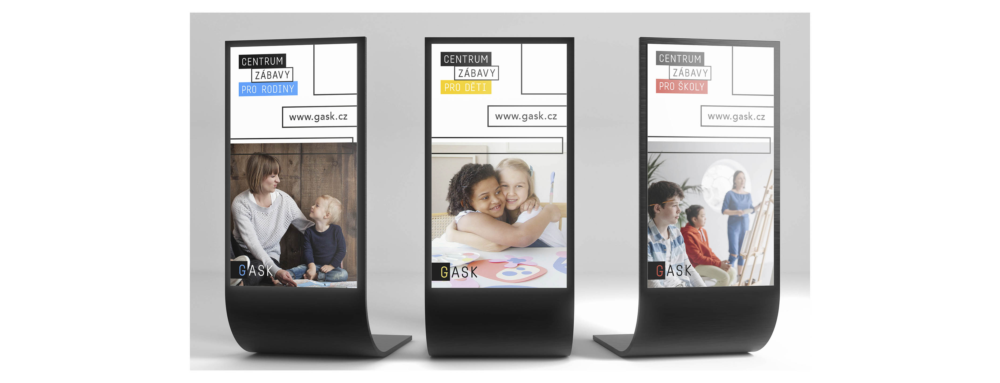
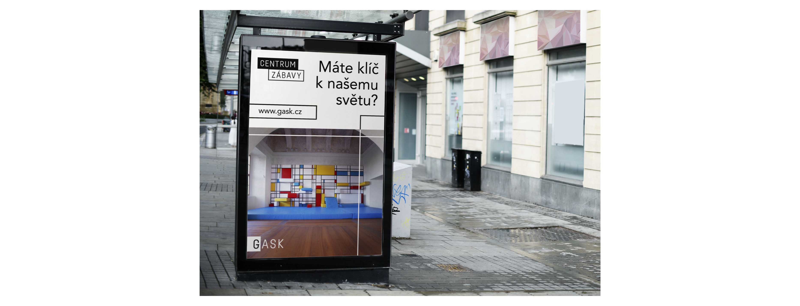
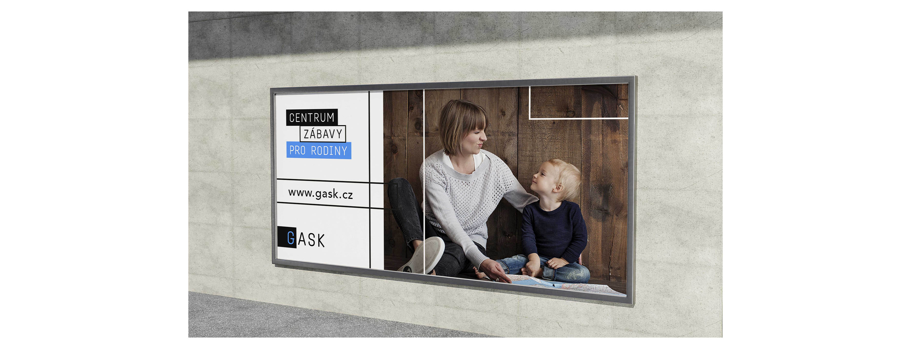
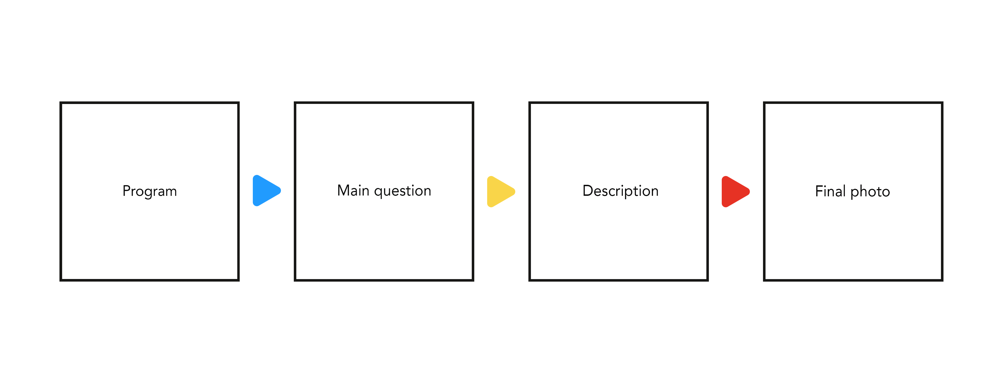
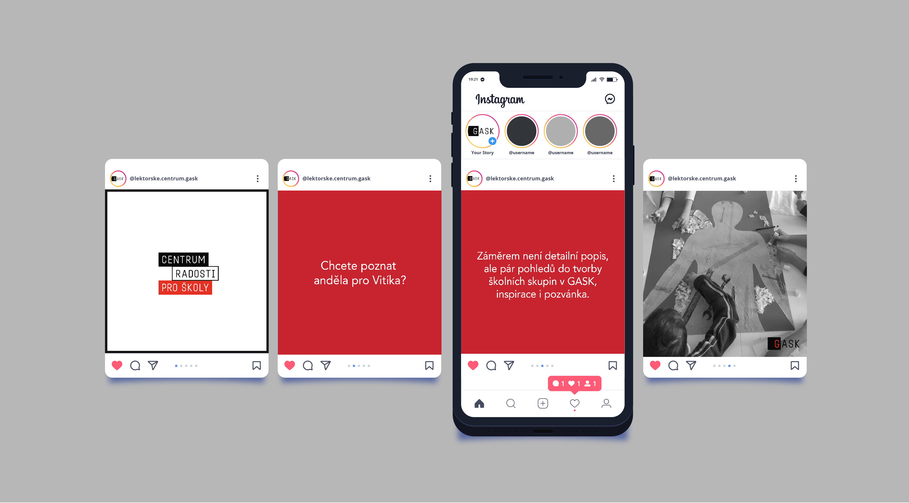

## 🟥 Visual identity and marketing communication of an education center GASK 🟨

### Abstract
- The project is still in process. My goal is to create new, original, visual communication and strategic solution for the education center and at the same time to raise the attendance of the gallery. Now I have analysis and research and I am working on a visual style. My important element is a strategic solution.

---

### Keywords
- colors, education center, GASK Kutná Hora, graphic design, logotype, marketing communication, new communication, presentation, typography, visual identity

---

### Presentation
#### Inspiration
- I chose 3 basic colors - red, yellow, blue.
- My great inspiration was a climbing wall for children and the flag of Kutná Hora. 
- My main and great inspiration are children. I want the overall visualization to be playful and funny.

#### Logotype
- I created a new logotype GASK that will characterize the education center. My primary goal was to create a logotype that will create simple communication. The word ASK will accompany us throughout the communication. 
- I created 3 variants of logotypes that characterize certain programs.

#### Slogan
- My goal was to create a slogan that describes what the center offers us. 
- ,,Center of fun"

- Next, we assign the selected program to the slogan.
- 🔵 for family, 🟡 for kids, 🔴 for school

#### Posters

#### Billboards

#### Social media
- For example, Instagram - I created four posts that describe what the structure should look like.

- There is the visualization of social networks.

- Maybe will be some changes. My project is mostly focused on marketing strategy and I create visualization at the last minute. 

