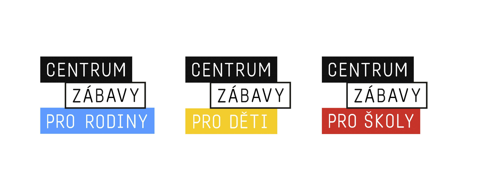
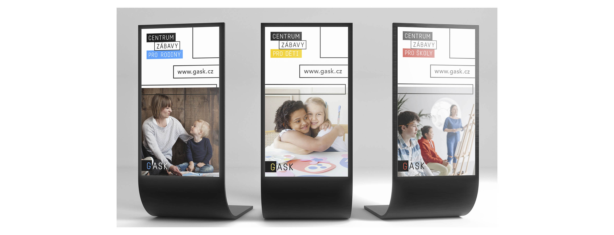
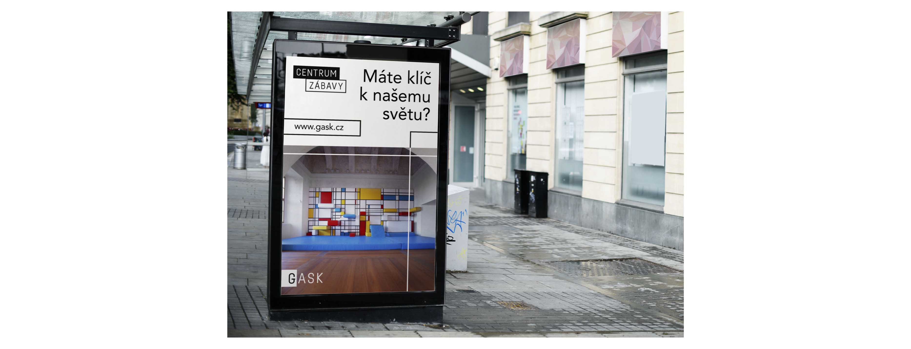
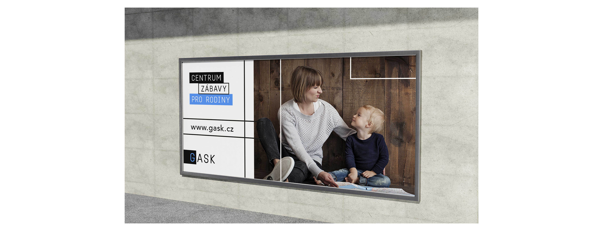
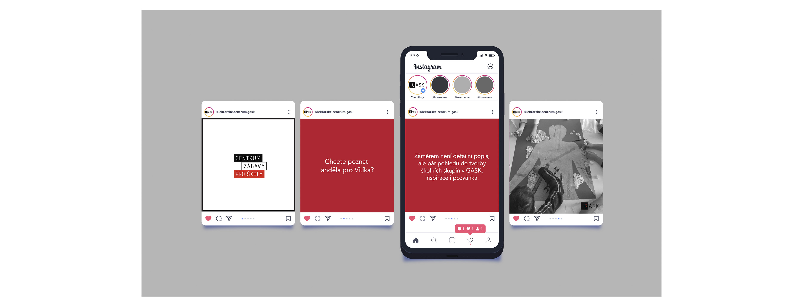

## 🟥 Title: Digest: Unified visual identity and marketing communication of an education center GASK.

## 🟨 Running Title: Unified visual identity 

Author Name(s): Tereza Budská

E-mail(s): terkabudska462@gmail.com

Acknowledgement(s): MgA. Jan Kolář ???

Data Accessibility/Availability Statement:
The data that support the findings of this study are openly available in:
- https://www.gask.cz/cs
- https://encyklopedie.soc.cas.cz/w/Komunikace_masová
- https://unie-grafickeho-designu.cz/vlastnosti-dobreho-loga-obsahly-clanek/
- https://destinace.kutnahora.cz/d/jezuitska-kolej-gask

Word count: ??? - Digests should be approximately 500 words.

- - -

## Digest: Unified visual identity 

### Abstract
- ??? - Less than 75 words.

### Keywords
- analysis, colors, communication, customers, design, education center, gallery, GASK Kutná Hora, graphic design, identity, kids, logotype, marketing, strategy, social media, typography, visualization

### Main Text
1. During my studies at the school in the field of graphic design and media communication, I gained a lot of experience. For this reason, I decided to accept the challenge in the field of visual and marketing communication and create a new working concept of visual communication for the education center. The center is operated by the organization Gallery of the Central Bohemian Region in Kutná Hora. The center was established to understand and bring contemporary art to the public as a natural way of life. My goal is to create visual communication and strategic solution for the education center GASK in Kutná Hora and at the same time to raise attendance of the Gallery of the Central Bohemian Region. At the same time, I want to raise the profile of the education center, to build a positive public attitude towards this place so that the GASK organization becomes a new refuge and visiting the place.
2. Summary of original article’s methods and results.
3. Further discussion on significance of findings.
4. Discussion connecting this work to other studies – provides added value through citations not included in original study.

### References
- BERAN, Vladimír, František ŠTORM, Vladimír KOLENSKÝ, Mgr. T. FASSATI. Aktualizovaný typografický manuál. [7th edition]
- HARANTOVÁ, Lenka. Vnímání sociální reklamy vysokoškolskými studenty. [1st edition]
- HOLLIS, Richard. Stručná historie grafického designu. [1st edition] 
- SVĚTLÍK, Jaroslav. Reklama - teorie, koncepce a modely. [online]
- VYSEKALOVÁ, Jitka. Psychologie reklamy. [4th extended updated edition] 

### Images
- I created a new logotype GASK that will characterize the education center. My primary goal was to create a logotype that will create simple communication. The word ASK will accompany us throughout the communication. 
- I created 3 variants of logotypes that characterize certain programs.

#### Slogan
- My goal was to create a slogan that describes what the center offers us. 
- ,,Center of fun"

- Next, we assign the selected program to the slogan.
- 🔵 for family, 🟡 for kids, 🔴 for school

#### Posters

#### Billboards

#### Social media
- For example, Instagram - I created four posts that describe what the structure should look like.
- There is the visualization of social networks.

