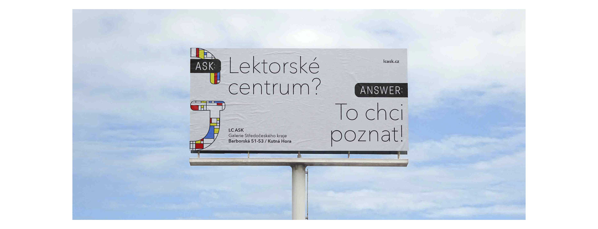
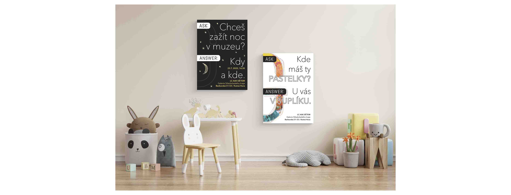

## Title: Digest: Unified visual identity and marketing communication of an education center GASK.

## Running Title: Unified visual identity 

Author Name(s): Tereza Budská

E-mail(s): terkabudska462@gmail.com

Acknowledgement(s): I would like to take this opportunity to thank my supervisor for my bachelor's thesis, Mr. MgA. Jan Kolář, for his guidance, advice, and patience. I would also like to thank the GASK Teaching Center in Kutná Hora for providing materials and materials for my work. Last but not least, I want to thank my family, who were able to support me during my work and studies.

Data Accessibility/Availability Statement: There is no data archived.

Word count: ???

- - -

## Digest: Unified visual identity 

### Abstract
- The bachelor's thesis deals with the creation of a communication strategy and visual identity for the GASK Education center in Kutná Hora. The thesis contains an explanation of basic concepts such as visual identity, logotype,  color, marketing communication, target group, means of communication, and strategy.  Finally, it describes the creation of a new unified communication concept, which helps to create a memorable image of the center.

### Keywords
- analysis, colors, communication, customers, design, education center, gallery, GASK Kutná Hora, graphic design, identity, kids, logotype, marketing, strategy, social media, typography, visualization

### Main Text
The center was established to understand and bring contemporary art to the audience. As the organization's teaching center does not currently have a comprehensive visual and communication style, I will also work on creating a new communication strategy.
The bachelor thesis is divided into the theoretical and practical parts. First of all, I will describe and explain the theoretical background that is necessary for the practical part of the bachelor's thesis, I will also analyze the techniques and tools used.
In the practical part, I analyze the current state of the researched teaching center and describe my design of marketing and visual communication.
My main goal is to create visual communication and strategic solution for the GASK teaching center in Kutná Hora and at the same time to raise awareness of the existence of the Central Bohemian Region Gallery. At the same time, I want to raise the profile and raise the teaching center, to build positive public relations with this place so that the GASK organization becomes a new refuge and visit the place.

### References
- BERAN, Vladimír, František ŠTORM, Vladimír KOLENSKÝ, Mgr. T. FASSATI. Aktualizovaný typografický manuál. [7th edition]
- HARANTOVÁ, Lenka. Vnímání sociální reklamy vysokoškolskými studenty. [1st edition]
- HOLLIS, Richard. Stručná historie grafického designu. [1st edition] 
- VYSEKALOVÁ, Jitka. Psychologie reklamy. [4th extended updated edition] 

### Images
#### Logotype ASK
- I created a new logotype ASK that will characterize the education center. My primary goal was to create a logotype that will create simple communication. The word ASK and ANSWER will accompany us throughout the communication.

#### Education Center ASK
- The first concept is the design of outdoor advertising (Citylights and Billboards), which introduces the education center. Each piece of information brings with it an important message that informs about an interesting activity, or some interesting thing. 

#### Programs
- It is also important to present the individual programs that the center offers. Posters are the main advertising medium.
- ASK - family ,,Shall we take daddy with us?"
- ASK - school ,,Do I have to use a ruler?"
- ASK - kids ,,Which color is the right one?"

#### ASK Kids
- important points - playful, fun, colorful, sketch
- For the ASK KIDS concept, I will also use outdoor advertisements (Citylights) and posters that are placed indoors. (toy store, children's parks, kindergartens...)

#### ASK Family
- important points - friendly, love, blue color, purity, honest
- For the ASK FAMILY concept, I will also use outdoor advertisements (Billboards) and social media. (I'll add more images later - still in process) 

#### ASK School
- important points - education, friendly, red color, inspiration, concentration
- still in process...:)

