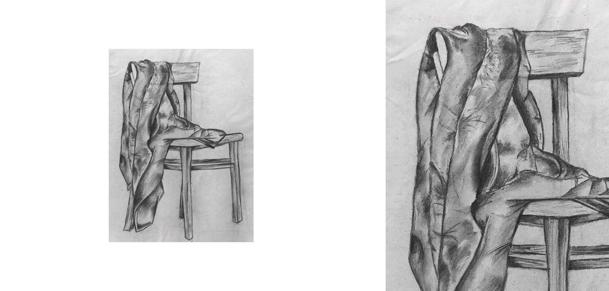
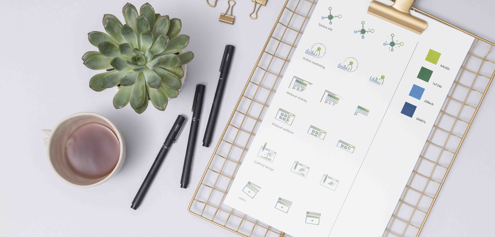
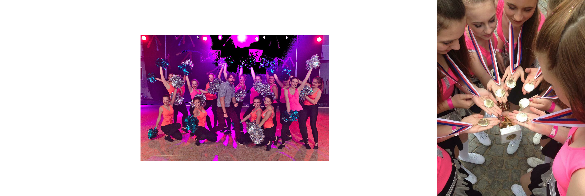

#  My design story 👩🏼‍🎨 

Hi! I am a graphic designer and I am specializing in creativity and visual identity.

The first question is why did I decide to be an artist?

- My journey started at about 11 years old... At this age, I fell in love with art. I started drawing on notebooks, on desks, sometimes on the walls. I learned what magic can you do with two ordinary - black and white. That was the point why I decided to absolve an art course called Draw Planet in Prague. 
So that was the reason why I decided to continue my studies at art school. At the same time, this course prepared me for the exams in high school.

In my free time, I sketched and started painting on the wall like a real painter. And there is my first picture from Draw Planet and painting on the wall!

- My journey continued at the DUKE high school - design and art, book culture, and economics in Náhorní. Over the course of 4 years, I learned to work with watercolors, inks, or pastels.
It was a very creative school.

- During our studies, we had to undertake the required internship for 10 days. I wrote an email to an IT company called Abuco ICT, which I stumbled upon on the Internet, and in the end, I was offered a job.
Now I work in this company as a creative graphic designer. Most often I work with online advertising, I create banners, posts, gifs, icons, and sometimes with offline advertising such as flyers, business cards, flags, posters.
There are some of the icons I created for the company.

- However, we will deviate a bit from the artistic side … My great inspiration was dancing. From the age of 5, I danced various types of dance such as aerobics, street dance, or cheerleaders. Thanks to this sport, I came up with many ideas. In this sport, I have relaxed from all worries and responsibilities. I felt like I was a completely different person. However, the team fell apart, but I still like to run and dance for myself…

- Now. I'm here. I study at university and work with 3 companies. I'm a girl, a cat lover. I like to go out where I gather inspiration and look for strength.

Thank you for your attention!

